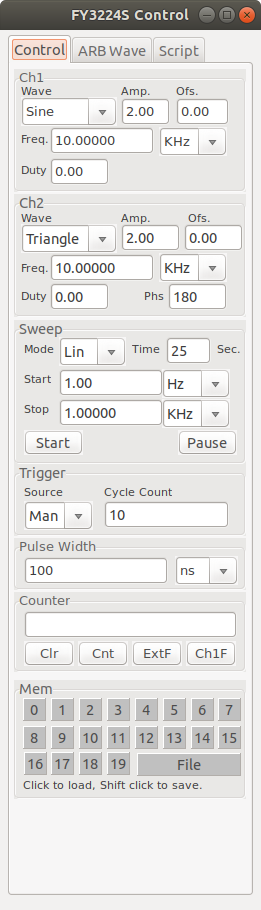
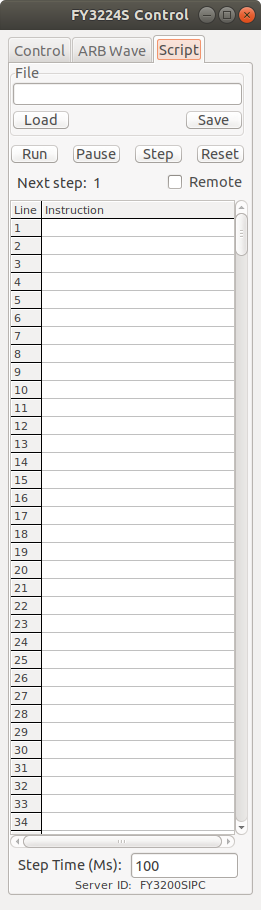

# FeelTech-FY3200S-Control-Panel-Library-for-Linux
A Library and GUI to Control a FeelTech FY3200S Signal Generator for Linux using FreePascal &amp; Lazarus

This is a control program and library of control functions for the FeelTech
FYS3200S Dual Channel signal generator, written using Lazarus/Free Pascal.
Lazarus allows the source code here to be compiled for several different operating
system environments (Linux,Windows, Mac).  The executable included is compiled for
Ubuntu Linux environment.

The code was written for personal use and does a bare minimum of error detection and
correction.

The library of functions contained in the file "fyLib.pas" may be useful to you
even if you don't want to adopt my Lazarus-based GUI. It exposes all of the
"magic numbers" that are used to control the signal generator, and the pascal language
is pretty easy to read and understand even if you aren't a pascal programmer.
The library unit handles creating and closing a communications link to the
FY3200S instrument via "/dev/ttyUSB0" using the synaSER unit, the source of which is
included in the files.  A Lazarus component wrapper for the synaSER unit can be
downloaded from the internet (search for "SDPOserial") but I chose not to use it
so that the fylib.pas unit would not rely of the Lazarus GUI.

There are three tabs on the executable program's Graphical interface:  Control,
Wave and Script.  The Control tab contains all of the basic controls for the
FY3200S that I have been able to discover (there may be more:  if you find some,
please let me know!)  The Wave tab allows you to configure the four arbitrary
waveforms that can be stored in the instrument's memory (ARB1 ~ ARB4).  The
Script tab allows you to write simple scripts that will control the instrument,
stepping between a sequence of control settings.

CONTROL TAB

The controls on this tab let you manually control the various programmabe features
of the instrument.

You can activate any one of the twenty full control states stored in the instrument's
internal memory by clicking on the desired numbered button in the "Mem" panel.
You can also load a complete control state from a disk file by clicking on the
"File" button in the Mem panel.

To save the current control state into one of the instrument's memories, or to
save the state into a disk file, Shift+Click on the desired button in the "Mem"
panel.

ARB WAVE TAB

This tab allows you to load an arbitrary waveform defined in a disk file into one
of the four arbitrary waveform memories of the FY3200S (ARB1 ~ ARB4).  The file
must must be a text file consisting of exactly 2048 lines, with each line containing
a single number in the range [-1.0, 1.0]. The file extension must be either ".ftw"
or ".csv".  An example file is included with the source files. (Files in this format
can be created using a spreadsheet like LibreCalc and exporting a single column
of 2048 floating point numbers as a ".CSV" formated text file.)

o  Select the arbitrary waveform you want to define (1,2,3 or 4);
o  Click the "From File" edit box to define the file name containing the waveform
   data.  If the file you select is not in the proper form, you will be asked to
   try again.
o  Review the waveform data as shown on the tab as a list of integers in the range
   [0..4095], and if everything is correct click the "Run" button to begin to
   transfer the waveform data to the FT3200S arbitrary function memory you selected.
   This takes a while.

SCRIPT TAB

This tab provides a very primative script capability for controling the FT3200S.
It allows you to load, edit, save and execute a simple script file contining a
sequence of commands that will be interpreted and sent to the instrument.

A script file is simply a text file with each line in the file consisting
of a number of comma-seperated instructions, where each instruction consists of a
two character code followed by a parameter. As an example, the command string

          "WP0,FP1000.00,AP2.00"

contains three instructions that will cause the primary, or Ch1, waveform ("WP") to
be set to "Sine", its frequency ("FP") to be set to 1000.00 Hz and its peak-to-peak
amplitude ("AP") set to 2.00 volts.

The set of understood instructions is as follows, where "n" denotes an integer value
and "f" denotes a fixed point real value with two places after the decimal point.

   WPn -- set primary waveform n
   FPf -- set primary channel frequency f
   OPf -- set primary channel offset
   APf -- set primary peak-to-peak amplitude
   DPn -- set primary channel duty cycle

   WSn -- set secondary waveform n
   FSf -- set secondary channel frequency f
   OSf -- set secondary channel offset
   ASf -- set secondary peak-to-peak amplitude
   DSn -- set secondary channel duty cycle
   PHn -- set secondary channel phase relative to the primary channel

   GTn -- go to line n of the script

Note that there is no "conditional branching" capability:  no "If x then y" sort
of commands.  A script execution ends when an eror is detected or a comment line
is encountered.

If the numerical parameter n or f after the instruction code is out of range for
the particular instruction, a message will be displayed and script execution will
be halted.

Script files can be created with just about any text editor.  Each line in the
file is assumed to be terminated by a CR/LF pair.  Script length is limited to
500 lines, although that can be easily changes in the program.  A comment,
always preceeded by a semicolon, can be appended to the end of any line, or
after the last line containing a command (commands must always begin on the
first line of the script).

(FY3200S is the Linux executable for this program.  It was compiled with debugging turned on, hence its large size.)
